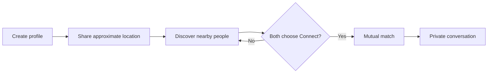
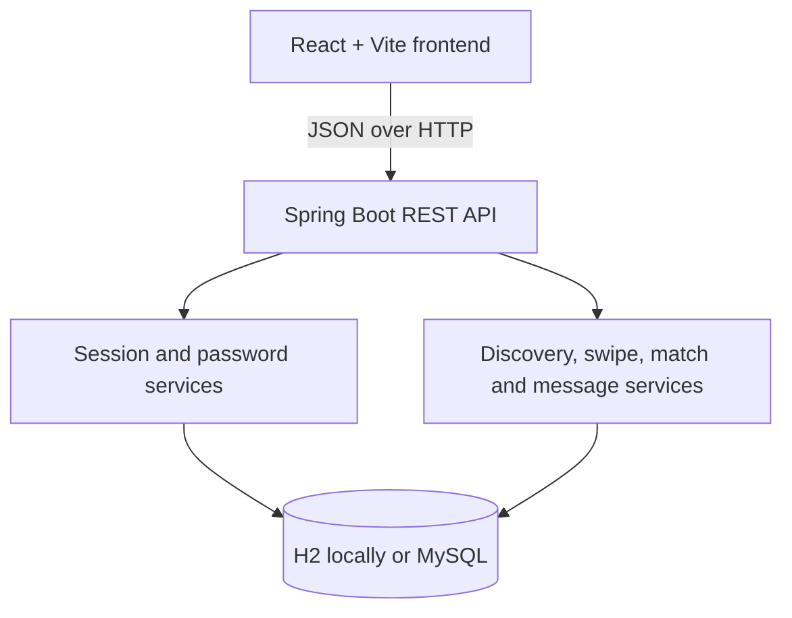

<div align="center">

# Near Connect

### Discover nearby people. Connect mutually. Start real conversations.

[](https://openjdk.org/)
[](https://spring.io/projects/spring-boot)
[](https://react.dev/)
[](https://vite.dev/)

Near Connect is a privacy-aware, Tinder-style local discovery application.
People discover profiles within a chosen radius, privately pass or request a
connection, match only when interest is mutual, and then chat one-to-one.

</div>

## Product highlights

- Secure registration and sign-in using PBKDF2-HMAC-SHA256 password hashing
- Random 30-day bearer sessions for protected API operations
- Browser geolocation with explicit user consent
- Nearby discovery across 5, 10, 25, or 50 km radiuses
- Button and drag-based Pass/Connect interactions
- Mutual matching with canonical pairs and duplicate prevention
- Private messaging available only between matched users
- Connection list sorted by the latest conversation activity
- Editable name, bio, current vibe, and discovery location
- Responsive desktop and mobile experience
- Zero-configuration persistent H2 database for local development
- Optional MySQL support through environment variables
- Seeded Bhubaneswar demo profiles for immediate testing

## How it works



Passes remain private. A match is created only when both people independently
choose **Connect**.

## Architecture



| Layer | Technology |
| --- | --- |
| Frontend | React 19, Vite 8, Framer Motion, CSS |
| Backend | Java 17+, Spring Boot 4, Spring MVC |
| Persistence | Spring Data JPA, H2, optional MySQL |
| Authentication | Random bearer sessions |
| Password storage | PBKDF2-HMAC-SHA256 with per-password salt |

## Project structure

```text
Near-Connect/
├── backend/
│   ├── pom.xml
│   └── src/
│       ├── main/java/com/nearconnect/backend/
│       │   ├── config/
│       │   ├── controller/
│       │   ├── dto/
│       │   ├── exception/
│       │   ├── model/
│       │   ├── repository/
│       │   └── service/
│       └── test/
├── frontend/
│   ├── src/
│   │   ├── components/
│   │   ├── pages/
│   │   └── services/
│   ├── package.json
│   └── vite.config.js
├── .github/agents/
└── README.md
```

## Local setup

### Requirements

- Java JDK 17 or newer
- Apache Maven 3.9 or newer
- Node.js 20 or newer
- npm

Verify the tools from PowerShell:

```powershell
java -version
javac -version
mvn -version
node -v
npm -v
```

### 1. Start the backend

```powershell
cd backend
mvn spring-boot:run
```

The API starts at `http://localhost:8080`. The default H2 database is stored
under `backend/data/` and persists between restarts.

Check API health:

```text
http://localhost:8080/api/users/health
```

### 2. Start the frontend

Open a second terminal:

```powershell
cd frontend
npm install
npm run dev
```

Open the URL printed by Vite, normally `http://localhost:5173`.

## Demo accounts

| Name | Email | Password |
| --- | --- | --- |
| Aditi Sharma | `aditi@nearconnect.app` | `demo1234` |
| Rohan Das | `rohan@nearconnect.app` | `demo1234` |

All seeded demo profiles use `demo1234`.

To test a real mutual match:

1. Sign in as Aditi in a normal browser window.
2. Sign in as Rohan in a private/incognito window.
3. Let both accounts choose **Connect** on each other.
4. Open **Connections** and start a conversation.

To reset demo activity, stop the backend, remove `backend/data/`, and restart
the backend. Never commit this directory.

## API reference

All protected endpoints require:

```http
Authorization: Bearer <session-token>
```

| Method | Endpoint | Access | Purpose |
| --- | --- | --- | --- |
| `POST` | `/api/users/register` | Public | Create an account and session |
| `POST` | `/api/users/login` | Public | Sign in and create a session |
| `POST` | `/api/users/logout` | Authenticated | End the current session |
| `GET` | `/api/users/me` | Authenticated | Read the current profile |
| `PUT` | `/api/users/me/profile` | Authenticated | Update public profile fields |
| `PUT` | `/api/users/me/location` | Authenticated | Update discovery coordinates |
| `GET` | `/api/users/nearby?radius=10` | Authenticated | Find unseen nearby profiles |
| `POST` | `/api/swipes` | Authenticated | Pass or request a connection |
| `GET` | `/api/matches` | Authenticated | List mutual connections |
| `GET` | `/api/messages?withUserId=1` | Matched users | Read a conversation |
| `POST` | `/api/messages` | Matched users | Send a message |

### Swipe request

```json
{
  "targetUserId": 2,
  "action": "LIKE"
}
```

Valid actions are `LIKE` and `PASS`.

### Message request

```json
{
  "receiverId": 2,
  "message": "Hi! Would you like to meet for coffee?"
}
```

## Configuration

The local setup requires no secrets or `.env` file.

| Variable | Default | Purpose |
| --- | --- | --- |
| `PORT` | `8080` | Backend HTTP port |
| `DB_URL` | Local H2 file URL | JDBC connection URL |
| `DB_USERNAME` | `sa` | Database username |
| `DB_PASSWORD` | Empty | Database password |
| `ALLOWED_ORIGINS` | Local Vite URLs | Comma-separated CORS origins |
| `DEMO_SEED` | `true` | Create local demo profiles |
| `VITE_API_URL` | `http://localhost:8080/api` | Frontend API base URL |

Example MySQL configuration:

```text
DB_URL=jdbc:mysql://localhost:3306/nearconnect
DB_USERNAME=nearconnect_app
DB_PASSWORD=replace-with-a-secret-environment-value
DEMO_SEED=false
```

Never commit real passwords, tokens, production endpoints, or private user
location data.

## Validation

Run the backend test suite:

```powershell
cd backend
mvn test
```

Run frontend quality checks:

```powershell
cd frontend
npm run lint
npm run build
```

Both commands should pass before merging or deploying a change.

## Current scope and roadmap

Near Connect is a complete local MVP. A public release still needs:

- Email verification and password reset
- HTTP-only secure cookie authentication
- Profile-photo upload and object storage
- Block, report, moderation, and user-safety workflows
- Rate limiting and abuse detection
- Real-time WebSocket messaging and delivery/read status
- Database migrations and managed production storage
- Privacy Policy, Terms, and account-deletion flows
- CI/CD, monitoring, backups, and production deployment

## Contributing

1. Create a branch from the repository's default branch.
2. Keep backend contracts and frontend calls synchronized.
3. Never weaken authentication, matching, or messaging authorization.
4. Run backend tests, frontend lint, and frontend build.
5. Submit a focused pull request describing behavior and validation.

## License

No open-source license has been selected yet. Add a `LICENSE` file before
redistributing or accepting external contributions.
